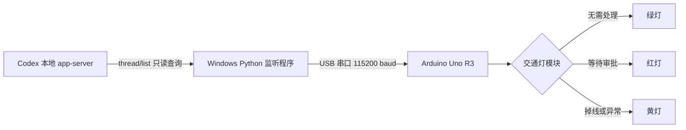

# Codex Traffic Light：为了少盯屏幕而做的实体审批信号灯

> 当 Codex 需要你审批时亮红灯；没有待审批事项时亮绿灯；程序掉线或状态读取异常时亮黄灯。

## 先说人话：为什么要做这个东西？

因为我想偷懒。

Codex 在执行任务时，经常可以自己工作很久，但碰到需要授权的操作时会停下来等人审批。问题是：

- 我不想每隔几十秒切回 Codex 看一眼；
- 我不想一直盯着屏幕等那个审批按钮出现；
- 我希望写代码时可以去喝水、看资料、整理桌面，甚至看另一块屏幕；
- 但我又不想让 Codex 因为等我点一下按钮而白白卡住十分钟。

所以这个项目把 Codex 的状态变成桌面上的实体交通灯：

- **绿灯：继续偷懒。** Codex 当前没有等你审批；
- **红灯：回来点一下。** 至少有一个 Codex 会话正在等待人工审批；
- **黄灯：系统不确定。** Arduino 没收到电脑心跳、串口断了，或者 Codex 状态读取失败。

这不是生产力革命，也不是复杂的智能家居系统。它只是一个非常直接、非常显眼的“别再盯窗口了”装置。

---

## 最后会得到什么效果？

电脑旁边会放着一个三色交通灯模块。Arduino 通过 USB 与 Windows 电脑连接，电脑端程序读取本机 Codex 的线程状态，再通过串口告诉 Arduino 应该亮哪盏灯。

| 实际状态 | 信号灯 | 你应该做什么 |
|---|---:|---|
| 没有 Codex 会话等待审批 | 🟢 绿灯 | 什么都不用做，继续干别的 |
| 任意一个 Codex 会话进入 `waitingOnApproval` | 🔴 红灯 | 打开 Codex，阅读请求并决定允许或拒绝 |
| 监听程序未运行、串口断开、Codex 状态读取失败 | 🟡 黄灯 | 检查程序、USB、COM 端口或 Codex |

默认情况下，只有真正的审批状态会亮红灯。Codex 的普通提问不会亮红灯；如果希望“任何等待你输入的情况”都亮红灯，可以修改配置，后文有说明。

### 工作流程



电脑端每隔约 0.75 秒读取一次状态。Arduino 同时要求电脑持续发送心跳；超过 15 秒收不到消息，就自动亮黄灯，避免程序已经死掉但灯还停留在一个看似正常的绿色状态。

---

## 支持范围

当前版本按下面的环境开发和验证：

- Windows 10 或 Windows 11；
- OpenAI Codex 桌面版/本地 Codex CLI；
- Arduino Uno R3；
- ATmega328P；
- 四针三色交通灯模块；
- Python 3.9 或更高版本，建议 Python 3.11；
- Codex CLI `0.150.1` 已完成真实状态握手测试。

电脑端使用 Windows 的 stdio app-server 启动方式，因此目前没有声称支持 macOS 或 Linux。Arduino 固件本身不依赖 Windows，但其他系统需要改造电脑端入口。

Codex 的本地 app-server 协议可能随版本变化。如果未来 Codex 更新后一直显示黄灯，请先查看本文“升级后突然失效”一节。

---

## 需要买什么？

### 必需硬件

| 数量 | 硬件 | 建议/关键词 | 用途 |
|---:|---|---|---|
| 1 | Arduino Uno R3 | `Arduino Uno R3 ATmega328P` | 接收电脑命令并控制三盏 LED |
| 1 | 三色交通灯模块 | `Arduino 交通灯模块 4针 GND G Y R` | 显示红、黄、绿三种状态 |
| 4 | 杜邦线 | 通常需要母对母 | 连接 Uno 母座与模块公针 |
| 1 | USB 数据线 | Uno R3 通常使用 USB-A 转 USB-B 方口线 | 供电、上传固件和串口通信 |
| 1 | Windows 电脑 | 能运行 Codex、Python 和 Arduino IDE | 读取 Codex 状态 |

### 为什么通常要“母对母”杜邦线？

标准 Uno R3 上是母座，常见交通灯模块上是公针，所以两端都需要母头。如果你的模块没有焊排针，可能还需要：

- 1×4 公排针；
- 电烙铁和焊锡；
- 或一块面包板，再根据实际接口换成公对母/公对公杜邦线。

购买前看清商品照片，不要只看标题。

### 可能需要但不一定要买

- **CH340/CH341 驱动**：部分兼容版 Uno 使用 CH340 USB 转串口芯片。它通常只需要安装驱动，不是额外硬件；
- **万用表**：如果模块丝印奇怪、无法确定公共地，非常建议用它确认；
- **外壳或支架**：让成品更像真正的桌面交通灯；
- **USB 延长线**：方便把灯放到视线边缘；
- **双面胶/磁吸底座**：固定模块，避免短路；
- **热缩管**：保护裸露焊点。

### 不需要购买的东西

- 不需要外接 5V 电源；
- 不需要继电器；
- 不需要 Wi-Fi 模块；
- 不需要 ESP32；
- 不需要给每个 LED 额外加电阻——常见成品交通灯模块已经带限流电阻，但必须检查你的具体模块；
- 不需要 OpenAI API Key，本项目读取的是本机 Codex 状态，不调用收费 API。

---

## 软件准备

安装下面三样软件：

1. **Codex 桌面版或 Codex CLI**，并确保平时可以正常使用；
2. **Arduino IDE 2.x**，用于给 Uno 上传固件；
3. **Python 3.9+**，安装时勾选“Add Python to PATH”。

在 PowerShell 中检查：

```powershell
python --version
codex --version
```

两个命令都应该打印版本号。如果 `python` 找不到，重新安装 Python 并勾选 PATH；如果 `codex` 找不到，可以在后面的 `config.json` 中填写 `codex.exe` 的完整路径。

### 下载本项目

```powershell
git clone https://github.com/anonymousguestme-ctrl/Codex-Traffic-Light.git
cd Codex-Traffic-Light
```

也可以直接从 GitHub 下载 ZIP，解压后进入目录。

---

## 第一步：先认清交通灯模块的四个针脚

常见模块的针脚是：

```text
GND   G   Y   R
```

分别代表：

- `GND`：公共地；
- `G`：Green，绿灯控制；
- `Y`：Yellow，黄灯控制；
- `R`：Red，红灯控制。

用户手中的模块标签描述为 `GRN / G / Y / R`。这里必须特别小心：

- 常见产品通常写的是 `GND`，有时字体、拍摄角度或印刷会让 `D` 看起来像 `R`；
- 如果 PCB 上确实完整印着 `GRN`，不要只凭这个 README 就把它接地；
- 请先查看卖家的针脚图、原理图或商品说明；
- 没有资料时，用万用表确认公共端；
- 只有确认它是模块公共地以后，才把它接到 Arduino `GND`。

**绝对不要在不确认的情况下把这个公共针脚接到 5V。** 接错可能导致多灯异常、LED 过流或损坏模块。

本文后续把这个已确认的公共地针脚写作 `GRN(GND)`。

---

## 第二步：断电接线

先拔掉 Arduino USB。不要带电插拔杜邦线。

| 交通灯模块 | Arduino Uno R3 | 固件中的定义 |
|---|---|---|
| `GRN(GND)` | `GND` | 公共地 |
| `G` | 数字口 `D8` | `PIN_GREEN = 8` |
| `Y` | 数字口 `D9` | `PIN_YELLOW = 9` |
| `R` | 数字口 `D10` | `PIN_RED = 10` |

文字接线图：

```text
交通灯模块                      Arduino Uno R3

GRN / GND  ------------------>  GND
G          ------------------>  D8
Y          ------------------>  D9
R          ------------------>  D10
```

接完后逐根检查：

- 是否把公共地接到了 `GND` 而不是 `5V`；
- `G/Y/R` 有没有因为模块方向相反而左右看反；
- 杜邦线是否插到底；
- 裸露焊点是否会碰到金属桌面；
- 没有任何线接到 `VIN`、`3.3V` 或模拟口。

---

## 第三步：上传 Arduino 固件

固件位置：

```text
firmware/codex_traffic_light/codex_traffic_light.ino
```

操作步骤：

1. 用 USB 数据线连接 Uno 和电脑；
2. 打开 Arduino IDE；
3. 打开上面的 `.ino` 文件；
4. 进入“工具 → 开发板 → Arduino AVR Boards → Arduino Uno”；
5. 进入“工具 → 端口”，选择刚出现的 COM 端口；
6. 点击“验证”按钮，确认编译没有错误；
7. 点击“上传”；
8. 等待 IDE 显示上传成功。

如果菜单里没有 Arduino Uno：

1. 打开“工具 → 开发板 → 开发板管理器”；
2. 搜索 `Arduino AVR Boards`；
3. 安装官方包；
4. 重新选择 Arduino Uno。

### 上传成功后应该看到什么？

固件启动时默认亮黄灯，因为电脑监听程序还没有建立心跳。这是正常现象，不代表失败。

### 用串口监视器单独测试三盏灯

在运行电脑监听程序之前，可以先确认硬件：

1. 打开 Arduino IDE 串口监视器；
2. 波特率选择 `115200`；
3. 行尾选择“Newline/新行”；
4. 分别发送：

```text
GREEN
YELLOW
RED
OFF
PING
```

预期回复：

```text
OK GREEN
OK YELLOW
OK RED
OK OFF
PONG CODEX_TRAFFIC_LIGHT_V1
```

注意：超过 15 秒没有继续收到电脑命令，固件会自动回到黄灯。因此手动测试时灯过一会儿变黄是故障保护在工作。

测试完成后关闭串口监视器。监听程序和 Arduino IDE 串口监视器不能同时占用同一个 COM 端口。

### 如果灯的电平逻辑相反

默认固件认为模块是常见的高电平点亮：

```cpp
const bool ACTIVE_HIGH = true;
```

如果确认接线正确，但出现“应该灭的灯亮、应该亮的灯灭”，改成：

```cpp
const bool ACTIVE_HIGH = false;
```

然后重新上传固件。

---

## 第四步：先测试 Codex 状态读取，不连接 Arduino

关闭 Arduino IDE 串口监视器，在项目目录打开 PowerShell：

```powershell
.\start.ps1 -DryRun -Once
```

第一次运行时脚本会：

1. 在项目目录创建 `.venv` 虚拟环境；
2. 在虚拟环境中安装 `pyserial`；
3. 启动一次本地 Codex app-server；
4. 只读查询非归档 Codex 线程；
5. 打印当前应该显示的颜色后退出。

正常输出类似：

```text
信号灯：GREEN
```

`-DryRun` 表示不打开串口，适合先排除 Codex/Python 层的问题；`-Once` 表示只检查一次就退出。

### PowerShell 拒绝执行脚本

可以只为当前 PowerShell 窗口临时放行：

```powershell
Set-ExecutionPolicy -Scope Process Bypass
.\start.ps1 -DryRun -Once
```

关闭窗口后临时设置自动失效。

---

## 第五步：正式运行

确认 Arduino 固件已经上传，并且 Arduino IDE 串口监视器已经关闭，然后运行：

```powershell
.\start.ps1
```

如果自动识别成功，会看到类似：

```text
Arduino 串口：COM5
信号灯：GREEN
```

此 PowerShell 窗口保持运行。按 `Ctrl + C` 可以退出；程序退出前会尝试把灯切到黄灯，之后固件心跳超时也会保证回到黄灯。

---

## 第六步：配置 COM 端口和高级选项

默认配置可以直接使用。如果电脑上有蓝牙串口、其他开发板或多个 USB 串口，自动识别可能无法判断哪一个是 Uno。

复制配置模板：

```powershell
Copy-Item .\config.example.json .\config.json
```

模板内容：

```json
{
  "serial_port": "auto",
  "baud_rate": 115200,
  "poll_interval_seconds": 0.75,
  "codex_executable": "auto",
  "include_waiting_on_user_input": false
}
```

### `serial_port`

自动识别：

```json
"serial_port": "auto"
```

固定为某个端口：

```json
"serial_port": "COM5"
```

可以在“设备管理器 → 端口（COM 和 LPT）”中查看 Uno 的端口号。拔掉再插入，观察哪个条目消失/出现，是最直观的识别方法。

### `baud_rate`

必须与固件保持一致：

```json
"baud_rate": 115200
```

除非同时修改并重新上传 Arduino 固件，否则不要改。

### `poll_interval_seconds`

Codex 状态查询间隔，默认 0.75 秒：

```json
"poll_interval_seconds": 0.75
```

代码会强制最低 0.2 秒。没有必要设置得特别快，0.5–1 秒对实体提示灯已经足够。

### `codex_executable`

如果 `codex` 不在 PATH，可以填写完整路径，例如：

```json
"codex_executable": "C:\\Users\\你的用户名\\AppData\\Local\\Programs\\OpenAI\\Codex\\bin\\codex.exe"
```

JSON 中的反斜杠必须写成双反斜杠。

### `include_waiting_on_user_input`

默认只在审批时亮红灯：

```json
"include_waiting_on_user_input": false
```

如果希望 Codex 只要等待你回答任何问题就亮红灯：

```json
"include_waiting_on_user_input": true
```

这个选项很适合做无风险功能测试：设为 `true`，让 Codex 问你一个需要回答的问题，线程进入等待输入状态时应该亮红灯。

---

## 第七步：验证完整效果

### 验证绿灯

1. 启动 `start.ps1`；
2. 确认 Codex 没有待审批请求；
3. 应该亮绿灯。

### 验证红灯

最自然的测试方法是在正常使用 Codex 时，等它产生一个需要人工批准的操作。看到 Codex 的审批界面时，实体红灯应在约一秒内亮起。审批或拒绝后，若没有其他会话等待审批，应恢复绿灯。

不要为了测试而批准自己看不懂的危险命令。交通灯只负责提醒，不会替你审批，也不会降低审批本身的重要性。

如果暂时无法触发审批，可把 `include_waiting_on_user_input` 设为 `true`，用普通提问状态测试红灯链路；测试后再改回 `false`。

### 验证黄灯故障保护

在绿灯正常亮起时：

1. 按 `Ctrl + C` 停止监听程序，或拔掉 USB 数据连接；
2. 最迟约 15 秒后应亮黄灯；
3. 重新连接并启动程序后，应恢复为当前真实状态对应的颜色。

---

## 开机自动运行

先确保手动运行完全正常，再配置开机启动。

1. 按 `Win + R`；
2. 输入 `shell:startup`；
3. 在打开的启动目录里新建快捷方式；
4. 目标填写：

```text
powershell.exe -WindowStyle Hidden -ExecutionPolicy Bypass -File "C:\你的路径\Codex-Traffic-Light\start.ps1"
```

5. 将路径替换成真实项目路径；
6. 注销或重启 Windows 测试。

如果项目就在 G 盘：

```text
powershell.exe -WindowStyle Hidden -ExecutionPolicy Bypass -File "G:\codex-traffic-light\start.ps1"
```

注意：如果 G 盘是移动硬盘、U 盘或开机后盘符可能变化，不建议用它做自动启动位置。可以把仓库克隆到固定的本地磁盘目录。

### 如何停止隐藏运行的程序？

可以在任务管理器中结束对应的 `python.exe`/`powershell.exe`，或者先不要使用隐藏窗口，确认稳定后再加 `-WindowStyle Hidden`。

---

## 它到底如何判断 Codex 在等审批？

电脑端不会截图，不做 OCR，也不模拟鼠标。它启动本机 Codex app-server，通过 JSON-RPC 调用只读的：

```text
thread/list
```

程序检查每个线程的：

```text
Thread.status.activeFlags
```

只要任意线程包含：

```text
waitingOnApproval
```

就发送：

```text
RED\n
```

否则发送：

```text
GREEN\n
```

如果状态查询失败，则发送 `YELLOW`。Arduino 支持的完整文本命令为：

- `GREEN`
- `YELLOW`
- `RED`
- `OFF`
- `PING`

### 隐私说明

本项目为了判断灯色，只使用线程的运行状态；代码不会把 Codex 会话正文上传到项目作者的服务器，也没有项目作者自己的服务器。它不需要 OpenAI API Key。

不过，程序会启动你本机已经安装的 Codex app-server。使用前仍应自行阅读代码，并遵循你所在组织的安全政策。

### 它不会做什么？

- 不会自动点击“允许”；
- 不会自动拒绝；
- 不会读取或保存审批内容；
- 不会替你判断某个命令是否安全；
- 不会让危险操作变安全；
- 不会在电脑关机或 Arduino 断电时继续工作。

---

## 项目目录说明

```text
Codex-Traffic-Light/
├─ firmware/
│  └─ codex_traffic_light/
│     └─ codex_traffic_light.ino   # Arduino Uno 固件
├─ src/
│  ├─ codex_traffic_light.py       # 状态解析、JSON-RPC、串口控制
│  └─ run_direct.py                # Windows stdio app-server 入口
├─ tests/
│  └─ test_state.py                # 状态映射单元测试
├─ config.example.json             # 配置模板
├─ requirements.txt                # Python 依赖
├─ start.ps1                       # Windows 一键启动脚本
├─ handoof.md                      # 开发与交付记录
├─ LICENSE
└─ README.md
```

---

## 运行测试

第一次执行过 `start.ps1` 后，项目内已有 `.venv`：

```powershell
.\.venv\Scripts\python.exe .\tests\test_state.py
```

预期结果：

```text
Ran 3 tests
OK
```

只测试 Codex 状态：

```powershell
.\start.ps1 -DryRun -Once
```

---

## 超详细故障排查

### 1. Arduino IDE 里没有 COM 端口

依次检查：

1. USB 线是否是数据线，而不是只能充电的线；
2. 换电脑 USB 口；
3. 换 USB 线；
4. 打开设备管理器，看有没有带黄色感叹号的设备；
5. 如果是兼容版 Uno，确认 USB 转串口芯片是否为 CH340/CH341，并从可信来源安装对应驱动；
6. 按一下 Uno 的 Reset 键再观察；
7. 换另一台电脑判断是板子还是系统问题。

### 2. 固件上传失败或卡在 uploading

- 关闭 Arduino IDE 串口监视器；
- 停止 `start.ps1`；
- 确认开发板选择的是 Arduino Uno；
- 确认端口正确；
- 不要选择 Arduino Mega；
- 尝试按下 Reset 后立即上传；
- 兼容板可能使用旧 bootloader，但 Uno R3 一般不需要切换 Nano 的 bootloader 选项。

### 3. 启动程序提示“没有发现串口”

- 确认 Uno 已插入；
- 确认设备管理器能看到 COM 口；
- 关闭占用串口的 Arduino IDE、串口助手、PlatformIO；
- 创建 `config.json` 并手动填写 COM 端口；
- 拔插 Uno 后重新启动程序。

### 4. 提示发现多个可能串口

在设备管理器确定 Uno 的 COM 号，然后配置：

```json
{
  "serial_port": "COM5"
}
```

只需要写想覆盖的字段，未写字段继续使用默认值。

### 5. 一直亮黄灯

黄灯意味着“不确定”，按层排查：

1. `start.ps1` 窗口是否仍在运行；
2. 是否打印“Arduino 串口：COMx”；
3. 串口是否被其他软件占用；
4. 运行 `.\start.ps1 -DryRun -Once`，看 Codex 状态读取是否成功；
5. 确认 `codex --version` 正常；
6. 确认固件波特率和配置都是 115200；
7. 检查 USB 是否会间歇断连。

### 6. 一直亮绿灯，Codex 明明在等审批

- 确认当前界面真的是审批请求，而不是普通提问；
- 先把 `include_waiting_on_user_input` 设为 `true` 验证整个红灯链路；
- 运行 DryRun 观察打印状态；
- 检查 Codex 是否刚升级；
- 查看终端是否打印“Codex 状态读取失败”；
- 如果新版改变了 `Thread.status.activeFlags`，需要更新状态解析逻辑。

### 7. 一直亮红灯

可能是另一个 Codex 会话正在等待审批。本项目默认查看最多 100 个非归档交互线程，不只看当前窗口。检查其他 Codex 线程，完成或拒绝所有待审批请求。

如果启用了 `include_waiting_on_user_input`，普通等待回答也会保持红灯。

### 8. 红、黄、绿对应错了

- 核对 `G → D8`、`Y → D9`、`R → D10`；
- 不要按模块在桌面上的左右位置猜针脚；
- 用串口监视器分别发送 `GREEN/YELLOW/RED`；
- 如果只是亮灭逻辑反向，修改 `ACTIVE_HIGH`；
- 如果颜色串了，交换对应的控制线，而不是改公共地。

### 9. 三盏灯一起亮或亮度异常

立刻断开 USB，然后：

- 重新确认公共针脚到底是不是 GND；
- 查看卖家原理图；
- 确认模块自带限流电阻；
- 检查杜邦线之间是否短路；
- 不要继续靠试错通电。

### 10. `python` 命令找不到

重新安装 Python，勾选 Add Python to PATH。安装后关闭并重新打开 PowerShell，再运行：

```powershell
python --version
```

### 11. `pip install pyserial` 失败

- 检查网络；
- 检查公司代理/证书策略；
- 删除未完成的 `.venv` 后重试；
- 不要把第三方网站下载的同名 `serial.py` 放进项目目录；
- 正确包名是 `pyserial`，导入名是 `serial`。

### 12. Codex 升级后突然失效

先记录：

```powershell
codex --version
.\start.ps1 -DryRun -Once
```

如果 Codex app-server 的协议发生变化，请提交 GitHub Issue，并附上：

- Windows 版本；
- Codex 版本；
- Python 版本；
- 完整错误文本；
- 是否能正常执行 `codex`；
- 不要附带 token、账号信息或私人会话内容。

---

## 安全提示

- 本项目的红灯只是提醒你“有审批”，不是提醒你“这个审批安全”；
- 每次仍要阅读 Codex 请求的命令、路径、网络目标和影响范围；
- 不要因为想让红灯变绿就盲目批准；
- 接线前断电；
- 不确定公共针脚时先查资料或测量；
- 不要让裸露电路板接触金属物体；
- 本项目只用于低压 Arduino LED 模块，不能直接控制市电交通灯。

---

## 已知限制

- 当前电脑端仅按 Windows 环境实现；
- 依赖 Codex 本地 app-server 的状态字段，未来版本可能变化；
- 默认最多读取 100 个非归档交互线程；
- 只识别 `waitingOnApproval`，除非显式打开普通用户输入提醒；
- 自动串口选择在多个开发板同时连接时需要手动配置；
- 尚未为不同厂商、不同电平逻辑的所有交通灯模块做兼容性认证；
- Arduino 断电时当然不会亮任何灯。

---

## 可以继续怎么改？

一些很适合继续折腾的方向：

- 加蜂鸣器，红灯持续一段时间后轻响；
- 加实体按钮，用于静音或确认“我看到了”；
- 加 OLED 显示等待审批的会话数量；
- 支持 macOS/Linux；
- 做 3D 打印外壳；
- 增加 Windows 托盘图标；
- 支持多台电脑或网络信号灯；
- 在不读取会话正文的前提下显示不同类别的等待状态。

---

## License

MIT License。详见 [`LICENSE`](LICENSE)。

如果这个小灯让你少盯了几分钟 Codex 窗口，它就已经完成使命了。
