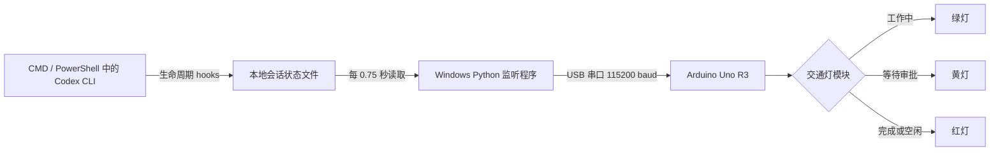

# Codex Status Traffic Light｜Codex 工作状态交通灯

> Codex 正在干活时亮绿灯；需要你审查或审批时亮黄灯；完成本轮工作、处于空闲或监听异常时亮红灯。

## 先说人话：为什么要做这个东西？

因为我想偷懒。

Codex 在执行任务时，经常可以自己工作很久，但碰到需要授权的操作时会停下来等人审批。问题是：

- 我不想每隔几十秒切回 Codex 看一眼；
- 我不想一直盯着屏幕等那个审批按钮出现；
- 我希望写代码时可以去喝水、看资料、整理桌面，甚至看另一块屏幕；
- 但我又不想让 Codex 因为等我点一下按钮而白白卡住十分钟。

所以这个项目把 Codex 的状态变成桌面上的实体交通灯：

- **绿灯：Codex 正在干活。** 你可以继续做别的；
- **黄灯：Codex 卡在你这里。** 至少有一个会话正在等待人工审查或审批；
- **红灯：Codex 干完了。** 当前没有仍在工作或等待审批的会话，可以回来看结果。

这不是生产力革命，也不是复杂的智能家居系统。它只是一个非常直接、非常显眼的“别再盯窗口了”装置。

---

## 最后会得到什么效果？

电脑旁边会放着一个三色交通灯模块。Arduino 通过 USB 与 Windows 电脑连接；CMD 或 PowerShell 中运行的 Codex CLI 通过官方生命周期 hooks 报告“开始工作、等待审批、完成回复”，电脑端监听程序再通过串口告诉 Arduino 应该亮哪盏灯。

| 实际状态 | 信号灯 | 你应该做什么 |
|---|---:|---|
| 任意 Codex 会话已经收到新提示、正在工作 | 🟢 绿灯 | 继续做别的，等它完成 |
| 任意 Codex 会话触发 `PermissionRequest` | 🟡 黄灯 | 回到对应终端，阅读请求并决定允许或拒绝 |
| 所有 Codex 会话都完成、尚未开始，或状态读取失败 | 🔴 红灯 | 查看结果；若状态不合理则检查监听程序 |

黄灯具有最高优先级：多个终端同时运行时，只要有一个会话等待审批就亮黄灯；否则，只要有一个会话仍在工作就亮绿灯；全部完成才亮红灯。

### 工作流程



电脑端每隔约 0.75 秒读取一次状态。Arduino 同时要求电脑持续发送心跳；新版固件超过 15 秒收不到消息会回到红灯，表示 Codex 已不再被确认处于工作状态。

---

## 支持范围

当前版本按下面的环境开发和验证：

- Windows 10 或 Windows 11；
- CMD 或 PowerShell 中运行的 OpenAI Codex CLI；
- Arduino Uno R3；
- ATmega328P；
- 四针三色交通灯模块；
- Python 3.9 或更高版本，建议 Python 3.11；
- Codex CLI `0.150.1`，并启用官方稳定 hooks 功能。

电脑端安装的是 Codex CLI 用户级 hook，因此无论从 CMD 还是 PowerShell 启动 `codex` 都可以触发同一个信号灯。Arduino 固件本身不依赖 Windows，但当前安装与启动脚本只按 Windows 实现。

Codex hook 格式可能随未来版本变化。如果 Codex 更新后灯不再随状态变化，请先查看本文“升级后突然失效”一节。

---

## 需要买什么？

### 必需硬件

| 数量 | 硬件 | 建议/关键词 | 用途 |
|---:|---|---|---|
| 1 | Arduino Uno R3 | `Arduino Uno R3 ATmega328P` | 接收电脑命令并控制三盏 LED |
| 1 | 三色交通灯模块 | `Arduino 交通灯模块 4针 GND G Y R` | 显示红、黄、绿三种状态 |
| 4 | 杜邦线 | 通常需要母对母 | 连接 Uno 母座与模块公针 |
| 1 | USB 数据线 | Uno R3 通常使用 USB-A 转 USB-B 方口线 | 供电、上传固件和串口通信 |
| 1 | Windows 电脑 | 能运行 Codex、Python 和 Arduino IDE | 读取 Codex 状态 |

### 为什么通常要“母对母”杜邦线？

标准 Uno R3 上是母座，常见交通灯模块上是公针，所以两端都需要母头。如果你的模块没有焊排针，可能还需要：

- 1×4 公排针；
- 电烙铁和焊锡；
- 或一块面包板，再根据实际接口换成公对母/公对公杜邦线。

购买前看清商品照片，不要只看标题。

### 可能需要但不一定要买

- **CH340/CH341 驱动**：部分兼容版 Uno 使用 CH340 USB 转串口芯片。它通常只需要安装驱动，不是额外硬件；
- **万用表**：如果模块丝印奇怪、无法确定公共地，非常建议用它确认；
- **外壳或支架**：让成品更像真正的桌面交通灯；
- **USB 延长线**：方便把灯放到视线边缘；
- **双面胶/磁吸底座**：固定模块，避免短路；
- **热缩管**：保护裸露焊点。

### 不需要购买的东西

- 不需要外接 5V 电源；
- 不需要继电器；
- 不需要 Wi-Fi 模块；
- 不需要 ESP32；
- 不需要给每个 LED 额外加电阻——常见成品交通灯模块已经带限流电阻，但必须检查你的具体模块；
- 不需要 OpenAI API Key，本项目读取的是本机 Codex 状态，不调用收费 API。

---

## 软件准备

安装下面三样软件：

1. **Codex CLI**，并确保能在 CMD 或 PowerShell 中正常运行 `codex`；
2. **Arduino IDE 2.x**，用于给 Uno 上传固件；
3. **Python 3.9+**，安装时勾选“Add Python to PATH”。

在 PowerShell 中检查：

```powershell
python --version
codex --version
```

两个命令都应该打印版本号。如果 `python` 找不到，重新安装 Python 并勾选 PATH；如果 `codex` 找不到，可以在后面的 `config.json` 中填写 `codex.exe` 的完整路径。

### 下载本项目

```powershell
git clone https://github.com/anonymousguestme-ctrl/Codex-Status-Traffic-Light.git
cd Codex-Status-Traffic-Light
```

也可以直接从 GitHub 下载 ZIP，解压后进入目录。

---

## 第一步：先认清交通灯模块的四个针脚

常见模块的针脚是：

```text
GND   G   Y   R
```

分别代表：

- `GND`：公共地；
- `G`：Green，绿灯控制；
- `Y`：Yellow，黄灯控制；
- `R`：Red，红灯控制。

用户手中的模块标签描述为 `GRN / G / Y / R`。这里必须特别小心：

- 常见产品通常写的是 `GND`，有时字体、拍摄角度或印刷会让 `D` 看起来像 `R`；
- 如果 PCB 上确实完整印着 `GRN`，不要只凭这个 README 就把它接地；
- 请先查看卖家的针脚图、原理图或商品说明；
- 没有资料时，用万用表确认公共端；
- 只有确认它是模块公共地以后，才把它接到 Arduino `GND`。

**绝对不要在不确认的情况下把这个公共针脚接到 5V。** 接错可能导致多灯异常、LED 过流或损坏模块。

本文后续把这个已确认的公共地针脚写作 `GRN(GND)`。

---

## 第二步：断电接线

先拔掉 Arduino USB。不要带电插拔杜邦线。

| 交通灯模块 | Arduino Uno R3 | 固件中的定义 |
|---|---|---|
| `GRN(GND)` | `GND` | 公共地 |
| `G` | 数字口 `D8` | `PIN_GREEN = 8` |
| `Y` | 数字口 `D9` | `PIN_YELLOW = 9` |
| `R` | 数字口 `D10` | `PIN_RED = 10` |

文字接线图：

```text
交通灯模块                      Arduino Uno R3

GRN / GND  ------------------>  GND
G          ------------------>  D8
Y          ------------------>  D9
R          ------------------>  D10
```

接完后逐根检查：

- 是否把公共地接到了 `GND` 而不是 `5V`；
- `G/Y/R` 有没有因为模块方向相反而左右看反；
- 杜邦线是否插到底；
- 裸露焊点是否会碰到金属桌面；
- 没有任何线接到 `VIN`、`3.3V` 或模拟口。

---

## 第三步：上传 Arduino 固件

固件位置：

```text
firmware/codex_traffic_light/codex_traffic_light.ino
```

操作步骤：

1. 用 USB 数据线连接 Uno 和电脑；
2. 打开 Arduino IDE；
3. 打开上面的 `.ino` 文件；
4. 进入“工具 → 开发板 → Arduino AVR Boards → Arduino Uno”；
5. 进入“工具 → 端口”，选择刚出现的 COM 端口；
6. 点击“验证”按钮，确认编译没有错误；
7. 点击“上传”；
8. 等待 IDE 显示上传成功。

如果菜单里没有 Arduino Uno：

1. 打开“工具 → 开发板 → 开发板管理器”；
2. 搜索 `Arduino AVR Boards`；
3. 安装官方包；
4. 重新选择 Arduino Uno。

### 上传成功后应该看到什么？

新版固件启动时默认亮红灯，因为电脑监听程序还没有报告 Codex 正在工作。这是正常现象。

### 用串口监视器单独测试三盏灯

在运行电脑监听程序之前，可以先确认硬件：

1. 打开 Arduino IDE 串口监视器；
2. 波特率选择 `115200`；
3. 行尾选择“Newline/新行”；
4. 分别发送：

```text
GREEN
YELLOW
RED
OFF
PING
```

预期回复：

```text
OK GREEN
OK YELLOW
OK RED
OK OFF
PONG CODEX_TRAFFIC_LIGHT_V1
```

注意：超过 15 秒没有继续收到电脑命令，固件会自动回到红灯。因此手动测试时灯过一会儿变红是故障保护在工作。

测试完成后关闭串口监视器。监听程序和 Arduino IDE 串口监视器不能同时占用同一个 COM 端口。

### 如果灯的电平逻辑相反

默认固件认为模块是常见的高电平点亮：

```cpp
const bool ACTIVE_HIGH = true;
```

如果确认接线正确，但出现“应该灭的灯亮、应该亮的灯灭”，改成：

```cpp
const bool ACTIVE_HIGH = false;
```

然后重新上传固件。

---

## 第四步：安装 Codex CLI 状态 hooks

这是监控 CMD/PowerShell Codex 的关键步骤。在项目目录打开 PowerShell：

```powershell
.\install-hooks.ps1
```

安装器会：

1. 在项目目录创建 `.venv` 虚拟环境；
2. 安装串口依赖 `pyserial`；
3. 读取现有的 `C:\Users\你的用户名\.codex\hooks.json`；
4. 保留其中不属于本项目的 hooks；
5. 添加 `UserPromptSubmit`、`PermissionRequest`、`PostToolUse`、`Stop`、`SessionStart/End` 等状态 hooks；
6. 如果原配置存在，先创建带时间戳的备份；
7. 在项目 `runtime` 目录写入已安装标记。

安装完成后，**完全退出所有正在运行的 Codex CLI，再重新打开 CMD 或 PowerShell 并运行 `codex`**。已经启动的 Codex 进程不会自动重新读取 hooks 配置。

Codex 首次加载非托管 hook 时会要求你审查和信任。请确认命令只指向本仓库的：

```text
src/hook_state.py
```

确认无误后选择信任。这个 hook 不会批准或拒绝请求，只写入/清除本地状态标记。

如需卸载：

```powershell
.\install-hooks.ps1 -Uninstall
```

卸载器只移除命令中指向本项目 `hook_state.py` 的处理器，保留其他 hooks。

---

## 第五步：先测试 hook 状态读取，不连接 Arduino

关闭 Arduino IDE 串口监视器，在项目目录打开 PowerShell：

```powershell
.\start.ps1 -DryRun -Once
```

程序会检查本地 hook 状态标记并打印当前应该显示的颜色后退出。

正常输出类似：

```text
信号灯：GREEN
```

`-DryRun` 表示不打开串口，适合先排除 hook/Python 层的问题；`-Once` 表示只检查一次就退出。

如果显示 `YELLOW` 并提示 hooks 尚未安装，请先执行上一节的 `install-hooks.ps1`。

### PowerShell 拒绝执行脚本

可以只为当前 PowerShell 窗口临时放行：

```powershell
Set-ExecutionPolicy -Scope Process Bypass
.\start.ps1 -DryRun -Once
```

关闭窗口后临时设置自动失效。

---

## 第六步：正式运行

确认 Arduino 固件已经上传，并且 Arduino IDE 串口监视器已经关闭，然后运行：

```powershell
.\start.ps1
```

如果自动识别成功，会看到类似：

```text
Arduino 串口：COM5
信号灯：GREEN
```

此 PowerShell 窗口保持运行。按 `Ctrl + C` 可以退出；程序退出前会尝试把灯切到红灯，之后新版固件心跳超时也会保证回到红灯。

---

## 第七步：配置 COM 端口和高级选项

默认配置可以直接使用。如果电脑上有蓝牙串口、其他开发板或多个 USB 串口，自动识别可能无法判断哪一个是 Uno。

复制配置模板：

```powershell
Copy-Item .\config.example.json .\config.json
```

模板内容：

```json
{
  "serial_port": "auto",
  "baud_rate": 115200,
  "poll_interval_seconds": 0.75,
  "hook_state_dir": "auto",
  "hook_state_max_age_seconds": 7200,
  "codex_sessions_dir": "auto"
}
```

### `serial_port`

自动识别：

```json
"serial_port": "auto"
```

固定为某个端口：

```json
"serial_port": "COM5"
```

可以在“设备管理器 → 端口（COM 和 LPT）”中查看 Uno 的端口号。拔掉再插入，观察哪个条目消失/出现，是最直观的识别方法。

### `baud_rate`

必须与固件保持一致：

```json
"baud_rate": 115200
```

除非同时修改并重新上传 Arduino 固件，否则不要改。

### `poll_interval_seconds`

Codex 状态查询间隔，默认 0.75 秒：

```json
"poll_interval_seconds": 0.75
```

代码会强制最低 0.2 秒。没有必要设置得特别快，0.5–1 秒对实体提示灯已经足够。

### `hook_state_dir`

默认的 `auto` 表示使用项目内的 `runtime/sessions`：

```json
"hook_state_dir": "auto"
```

通常不需要修改。若改成自定义绝对路径，还必须让 hook 脚本通过环境变量 `CODEX_TRAFFIC_LIGHT_STATE_DIR` 使用相同路径。

### `hook_state_max_age_seconds`

会话状态文件的故障兜底有效期，默认两小时：

```json
"hook_state_max_age_seconds": 7200
```

每次 hook 都会覆盖该会话的最新状态。这个超时用于 Codex 被强制结束、电脑崩溃等没有机会触发结束 hook 的情况；状态过期后按“完成/空闲”显示红灯。

### `codex_sessions_dir`

默认的 `auto` 表示增量读取当前用户的 `~/.codex/sessions` 本地事件流：

```json
"codex_sessions_dir": "auto"
```

它让监听器即使面对安装 hooks 之前已经打开的 Codex CLI，也能根据 `task_started` 和 `task_complete` 判断工作中与完成。程序只检查事件类型和时间戳，不使用或保存消息正文。通常不需要修改。

---

## 第八步：验证完整效果

### 验证绿灯

1. 启动 `start.ps1`；
2. 在新启动的 Codex CLI 中发送一条任务；
3. `UserPromptSubmit` 触发后应该亮绿灯，并在 Codex 工作期间保持。

### 验证黄灯

最自然的测试方法是在正常使用 Codex 时，等它产生一个需要人工批准的操作。看到 Codex 的审批界面时，实体黄灯应在约一秒内亮起。审批或拒绝后，Codex 继续执行工具时应恢复绿灯。

不要为了测试而批准自己看不懂的危险命令。交通灯只负责提醒，不会替你审批，也不会降低审批本身的重要性。

如果暂时无法自然触发审批，可以使用后文命令模拟会话状态；不要为了测试而批准危险命令。

### 验证红灯

等待 Codex 完成本轮回复；`Stop` hook 触发后应在约一秒内亮红灯。停止监听程序或拔掉 USB 后，新版固件也会在 15 秒心跳超时后回到红灯。

红灯既表示“工作完成/空闲”，也用作异常时的保守状态；如果 Codex 明明在工作却一直红灯，请检查 hooks、USB 和监听程序。

---

## 开机自动运行

先确保手动运行完全正常，再配置开机启动。

1. 按 `Win + R`；
2. 输入 `shell:startup`；
3. 在打开的启动目录里新建快捷方式；
4. 目标填写：

```text
powershell.exe -WindowStyle Hidden -ExecutionPolicy Bypass -File "C:\你的路径\Codex-Status-Traffic-Light\start.ps1"
```

5. 将路径替换成真实项目路径；
6. 注销或重启 Windows 测试。

如果项目就在 G 盘：

```text
powershell.exe -WindowStyle Hidden -ExecutionPolicy Bypass -File "G:\codex-traffic-light\start.ps1"
```

注意：如果 G 盘是移动硬盘、U 盘或开机后盘符可能变化，不建议用它做自动启动位置。可以把仓库克隆到固定的本地磁盘目录。

### 如何停止隐藏运行的程序？

可以在任务管理器中结束对应的 `python.exe`/`powershell.exe`，或者先不要使用隐藏窗口，确认稳定后再加 `-WindowStyle Hidden`。

---

## 它到底如何判断 Codex 状态？

电脑端不会截图，不做 OCR，也不读取 CMD/PowerShell 屏幕文字。它同时使用 Codex 官方生命周期 hooks 和本机 `~/.codex/sessions` 事件流：hooks 精确捕获审批，事件流补充捕获真实任务开始与完成，尤其适用于安装 hooks 前已经打开的 CLI。

本项目将官方 hook 事件映射为三个状态：

| Hook 事件 | 写入状态 | 灯色 |
|---|---|---|
| `UserPromptSubmit` | `working` | 绿灯 |
| `PermissionRequest` | `approval` | 黄灯 |
| `PostToolUse` | `working` | 绿灯 |
| `Stop` | `finished` | 红灯 |
| `SessionStart` | `finished` | 红灯 |
| `SessionEnd` | 删除该会话状态 | 由其余会话决定；无会话时红灯 |

事件流的补充映射为：

| 本地事件 | 灯色 |
|---|---|
| `task_started` | 绿灯 |
| `task_complete` 或 `turn_aborted` | 红灯 |
| 名称同时包含 `approval` 和 `request` 的审批事件 | 黄灯 |

每个 Codex 会话在 `runtime/sessions` 下只有一个很小的 JSON 状态文件，只包含：

- `session_id`；
- `turn_id`；
- 状态和更新时间；
- hook 事件名。

它不会把请求的命令、理由、提示词或会话正文写入状态文件。监听程序汇总全部会话，按 `approval > working > finished` 的优先级向 Arduino 发送 `YELLOW`、`GREEN` 或 `RED`。如果 hooks 没安装、状态目录损坏或串口失败，程序使用红灯，避免错误地声称 Codex 仍在工作。Arduino 支持的完整文本命令为：

- `GREEN`
- `YELLOW`
- `RED`
- `OFF`
- `PING`

### 隐私说明

本项目为了判断灯色，只使用本地 hooks 产生的会话状态文件；代码不会把 Codex 会话正文上传到项目作者的服务器，也没有项目作者自己的服务器。它不需要 OpenAI API Key。

事件含义和输入格式以 [OpenAI 官方 Codex Hooks 文档](https://learn.chatgpt.com/docs/hooks) 为准：`UserPromptSubmit` 表示提示即将发送，`PermissionRequest` 表示即将请求批准，`PostToolUse` 表示工具输出已经返回，`Stop` 表示主代理完成回复。

安装器会修改用户级 `~/.codex/hooks.json`。它会保留其他 hooks 并在覆盖前备份原文件，但使用前仍应自行阅读 `install_hooks.py` 和 `hook_state.py`，并遵循所在组织的安全政策。

### 它不会做什么？

- 不会自动点击“允许”；
- 不会自动拒绝；
- 不会读取或保存审批内容；
- 不会替你判断某个命令是否安全；
- 不会让危险操作变安全；
- 不会在电脑关机或 Arduino 断电时继续工作。

---

## 项目目录说明

```text
Codex-Status-Traffic-Light/
├─ firmware/
│  └─ codex_traffic_light/
│     └─ codex_traffic_light.ino   # Arduino Uno 固件
├─ src/
│  ├─ codex_traffic_light.py       # hook 状态读取与串口控制
│  ├─ hook_state.py                # Codex CLI hook 状态写入/清理
│  └─ install_hooks.py             # 安全合并用户 hooks.json
├─ tests/
│  ├─ test_state.py                # 状态映射单元测试
│  └─ test_hooks.py                # hook 与安装器测试
├─ config.example.json             # 配置模板
├─ requirements.txt                # Python 依赖
├─ install-hooks.ps1               # 安装/卸载 Codex CLI hooks
├─ start.ps1                       # Windows 一键启动脚本
├─ LICENSE
└─ README.md
```

---

## 运行测试

第一次执行过 `start.ps1` 后，项目内已有 `.venv`：

```powershell
.\.venv\Scripts\python.exe .\tests\test_state.py
.\.venv\Scripts\python.exe .\tests\test_hooks.py
```

预期结果：

```text
Ran 9 tests
OK
```

只测试 Codex 状态：

```powershell
.\start.ps1 -DryRun -Once
```

模拟三个状态（每条命令后都可以运行 `start.ps1 -DryRun -Once` 查看）：

```powershell
@{
  session_id = 'manual-test'
  turn_id = 'manual-turn'
  hook_event_name = 'UserPromptSubmit'
} | ConvertTo-Json | .\.venv\Scripts\python.exe .\src\hook_state.py set-working

.\start.ps1 -DryRun -Once
```

上面应输出 `GREEN`。继续模拟审批并验证 `YELLOW`：

```powershell
@{
  session_id = 'manual-test'
  turn_id = 'manual-turn'
  hook_event_name = 'PermissionRequest'
} | ConvertTo-Json | .\.venv\Scripts\python.exe .\src\hook_state.py set-approval

.\start.ps1 -DryRun -Once
```

最后模拟完成并验证 `RED`：

```powershell
@{
  session_id = 'manual-test'
  turn_id = 'manual-turn'
  hook_event_name = 'Stop'
} | ConvertTo-Json | .\.venv\Scripts\python.exe .\src\hook_state.py set-finished

.\start.ps1 -DryRun -Once
```

---

## 超详细故障排查

### 1. Arduino IDE 里没有 COM 端口

依次检查：

1. USB 线是否是数据线，而不是只能充电的线；
2. 换电脑 USB 口；
3. 换 USB 线；
4. 打开设备管理器，看有没有带黄色感叹号的设备；
5. 如果是兼容版 Uno，确认 USB 转串口芯片是否为 CH340/CH341，并从可信来源安装对应驱动；
6. 按一下 Uno 的 Reset 键再观察；
7. 换另一台电脑判断是板子还是系统问题。

### 2. 固件上传失败或卡在 uploading

- 关闭 Arduino IDE 串口监视器；
- 停止 `start.ps1`；
- 确认开发板选择的是 Arduino Uno；
- 确认端口正确；
- 不要选择 Arduino Mega；
- 尝试按下 Reset 后立即上传；
- 兼容板可能使用旧 bootloader，但 Uno R3 一般不需要切换 Nano 的 bootloader 选项。

### 3. 启动程序提示“没有发现串口”

- 确认 Uno 已插入；
- 确认设备管理器能看到 COM 口；
- 关闭占用串口的 Arduino IDE、串口助手、PlatformIO；
- 创建 `config.json` 并手动填写 COM 端口；
- 拔插 Uno 后重新启动程序。

### 4. 提示发现多个可能串口

在设备管理器确定 Uno 的 COM 号，然后配置：

```json
{
  "serial_port": "COM5"
}
```

只需要写想覆盖的字段，未写字段继续使用默认值。

### 5. 一直亮黄灯

黄灯意味着至少一个会话仍记录为“等待审批”，按层排查：

1. `start.ps1` 窗口是否仍在运行；
2. 是否打印“Arduino 串口：COMx”；
3. 串口是否被其他软件占用；
4. 是否已经执行 `.\install-hooks.ps1`；
5. 是否完全退出并重新打开过 Codex CLI；
6. Codex 第一次加载时是否已经审查并信任 hook；
7. 运行 `.\start.ps1 -DryRun -Once`，看 hook 状态读取是否成功；
8. 确认固件波特率和配置都是 115200；
9. 检查 USB 是否会间歇断连。

### 6. 一直亮绿灯，Codex 明明在等审批

- 确认当前界面真的是审批请求，而不是普通提问；
- 用“运行测试”一节的手动状态命令验证整个黄灯链路；
- 打开 `C:\Users\你的用户名\.codex\hooks.json`，确认命令路径仍指向当前项目；
- 如果移动过项目目录，重新运行 `install-hooks.ps1`；
- 确认新启动的 Codex 已信任 hooks；
- 检查 Codex 是否刚升级；
- 查看终端是否报告 hook 执行失败；
- 查看 `runtime/sessions` 中对应会话是否变为 `"state": "approval"`。

### 7. 一直亮红灯

红灯正常表示全部工作完成或空闲。如果 Codex 明明在工作仍是红灯，检查 `runtime/sessions` 是否在发送提示后出现 `"state": "working"`，并确认 Codex 是在安装 hooks 后完全退出再重新启动的。状态文件最长保留 `hook_state_max_age_seconds`；确认没有真实会话后，可以停止监听程序并删除 `runtime/sessions` 下的 JSON 文件。

### 8. 红、黄、绿对应错了

- 核对 `G → D8`、`Y → D9`、`R → D10`；
- 不要按模块在桌面上的左右位置猜针脚；
- 用串口监视器分别发送 `GREEN/YELLOW/RED`；
- 如果只是亮灭逻辑反向，修改 `ACTIVE_HIGH`；
- 如果颜色串了，交换对应的控制线，而不是改公共地。

### 9. 三盏灯一起亮或亮度异常

立刻断开 USB，然后：

- 重新确认公共针脚到底是不是 GND；
- 查看卖家原理图；
- 确认模块自带限流电阻；
- 检查杜邦线之间是否短路；
- 不要继续靠试错通电。

### 10. `python` 命令找不到

重新安装 Python，勾选 Add Python to PATH。安装后关闭并重新打开 PowerShell，再运行：

```powershell
python --version
```

### 11. `pip install pyserial` 失败

- 检查网络；
- 检查公司代理/证书策略；
- 删除未完成的 `.venv` 后重试；
- 不要把第三方网站下载的同名 `serial.py` 放进项目目录；
- 正确包名是 `pyserial`，导入名是 `serial`。

### 12. Codex 升级后突然失效

先记录：

```powershell
codex --version
.\start.ps1 -DryRun -Once
```

如果 Codex hooks 的事件或配置格式发生变化，请提交 GitHub Issue，并附上：

- Windows 版本；
- Codex 版本；
- Python 版本；
- 完整错误文本；
- 是否能正常执行 `codex`；
- 不要附带 token、账号信息或私人会话内容。

---

## 安全提示

- 本项目的黄灯只是提醒你“有审批”，不是提醒你“这个审批安全”；
- 每次仍要阅读 Codex 请求的命令、路径、网络目标和影响范围；
- 不要因为想让黄灯变绿就盲目批准；
- 接线前断电；
- 不确定公共针脚时先查资料或测量；
- 不要让裸露电路板接触金属物体；
- 本项目只用于低压 Arduino LED 模块，不能直接控制市电交通灯。

---

## 已知限制

- 当前电脑端仅按 Windows 环境实现；
- 依赖 Codex CLI 的 `PermissionRequest`、`PostToolUse` 和 `Stop` 等 hook 事件，未来版本可能变化；
- 当前只监控安装了用户级 hooks 的本机 Codex CLI，不监控网页、手机或其他电脑；
- 批准后黄灯通常会在工具完成并触发 `PostToolUse` 时恢复绿色；官方 hooks 没有单独的“审批弹窗刚关闭”事件，因此长时间运行的已批准命令可能让黄灯多保持一段时间；
- Codex 被强制结束时可能留下会话状态，默认两小时后自动视为过期并显示红灯；
- 自动串口选择在多个开发板同时连接时需要手动配置；
- 尚未为不同厂商、不同电平逻辑的所有交通灯模块做兼容性认证；
- Arduino 断电时当然不会亮任何灯。

---

## 可以继续怎么改？

一些很适合继续折腾的方向：

- 加蜂鸣器，红灯持续一段时间后轻响；
- 加实体按钮，用于静音或确认“我看到了”；
- 加 OLED 显示等待审批的会话数量；
- 支持 macOS/Linux；
- 做 3D 打印外壳；
- 增加 Windows 托盘图标；
- 支持多台电脑或网络信号灯；
- 在不读取会话正文的前提下显示不同类别的等待状态。

---

## License

MIT License。详见 [`LICENSE`](LICENSE)。

如果这个小灯让你少盯了几分钟 Codex 窗口，它就已经完成使命了。
